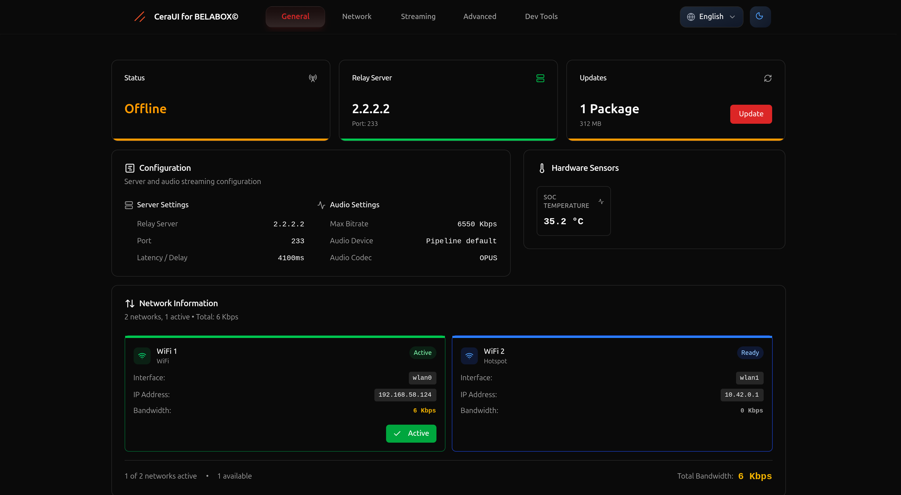

# CeraUI

CeraUI is a modern user interface built with **Svelte + Vite**, designed as an alternative frontend for [CeraLive](https://github.com/CeraLive/CeraLive). It communicates with the CeraLive WebSocket backend to provide a fast, interactive, and user-friendly experience.

## Features

- **Svelte 5 + Vite**: Enjoy a highly reactive and efficient UI built with the latest Svelte and Vite tooling.
- **Modern Design**: A sleek and minimalistic interface for an enhanced user experience.
- **Responsive Design**: The UI is optimized for all screen sizes.
- **WebSocket Integration**: Seamlessly communicates with the CeraLive backend.
- **Flexible Deployment**: Choose to serve on a different port with PM2 or replace the existing CeraLive content.
- **Remote Control**: Full remote control functionality even without the automatic relay server selection feature.

## Objectives

One of the long-term objectives of this project, which will commence once the UI has full functionality, is to support both maintaining **vanilla** CeraLive builds (as seen on [ceralive.net](https://ceralive.net/)) and creating a separate branch for custom development to extend CeraLive functionalities. Additionally, I am interested in the way [pjeweb/CeraLive](https://github.com/pjeweb/CeraLive) was restructured.

## Roadmap

- **Updating Overlay Image**: Find a better picture for the updating overlay.

## Installation

### Prerequisites

- **Node.js** (v16 or later recommended)
- **pnpm** (or npm/yarn)

### Clone the Repository

```sh
git clone https://github.com/CERALIVE/CeraUI.git
cd CeraUI
```

### Install Dependencies

Using `pnpm` (recommended):

```sh
pnpm install
```

Or using `npm`:

```sh
npm install
```

### Local Development Setup

For development, you can run the project in dev mode from your computer. First, copy the `.env.example` file to `.env`:

```sh
cp .env.example .env
```

Then, replace the `VITE_SOCKET_ENDPOINT` value in the `.env` file with the CeraLive IP address on your local network.

**Important:** Before building for production, remove the `.env` file so that the UI can load the IP dynamically from `window.location`.

### Running the Development Server

After setting up your environment, start the development server:

```sh
pnpm run dev
```

This will start a local development server, usually accessible at `http://localhost:5173/`.

### Building for Production

Generate an optimized production build:

```sh
pnpm run build
```

The production build will be output to the `dist` directory.

### Preview Production Build

To serve the production build locally:

```sh
pnpm run preview
```

## Deployment Options

### Serving on a Different Port with PM2

You can serve the UI on a different port using **PM2** and ensure it runs at startup:

1. Install PM2 globally if you haven't already:

    ```sh
    npm install -g pm2
    ```

2. Install a static server like `serve`:

    ```sh
    npm install -g serve
    ```

3. Start serving the production build with PM2 on port `8080` (or any port of your choice):

    ```sh
    pm2 start "serve -s dist -l 8080" --name CeraUI
    ```

4. Save the PM2 process list and configure it to run at startup:

    ```sh
    pm2 save
    pm2 startup
    ```

### Replacing the Existing CeraLive Frontend

If you prefer to replace the original CeraLive frontend with CeraUI, copy the build files into the correct location:

```sh
sudo cp -r dist/* /opt/CeraLive/public/
```

> **Note:** Replacing the original UI directly may cause issues. When CeraLive is updated, it can overwrite these files, removing your custom UI. Ensure you monitor updates and reapply your changes if necessary.

## 📸 Screenshots & Visual Documentation

CeraUI offers a comprehensive and intuitive interface with both light and dark theme support across desktop and mobile platforms. Experience the complete visual journey through our **[📸 Visual Gallery](docs/SCREENSHOTS.md)**.

### 🎯 Quick Preview

| **Desktop Interface** | **Mobile Experience** |
|:---------------------:|:---------------------:|
|  |  |
| *Full HD (1920×1080) optimized interface* | *iPhone 14 Pro Max (430×932) responsive design* |

### 🌟 Featured Highlights

- **🎨 Dual Theme Support**: Professional dark mode and clean light theme
- **📱 Responsive Design**: Seamless desktop and mobile experiences  
- **🔧 5 Core Tabs**: General, Network, Streaming, Advanced, and DevTools interfaces
- **🌐 Internationalization**: Complete multi-language support (10+ languages)
- **⚡ Progressive Web App**: Offline capabilities and native app-like performance
- **📸 22 Screenshots**: Complete visual documentation with enhanced capture timing

### 📖 Complete Documentation

Explore the full visual documentation with detailed interface breakdowns, feature demonstrations, and technical specifications in our comprehensive **[Screenshots Gallery](docs/SCREENSHOTS.md)**.

## Documentation

### Visual Documentation

- **[📸 Screenshots Gallery](docs/SCREENSHOTS.md)**: Complete visual documentation showcasing CeraUI's interface across desktop and mobile platforms. Features 22 high-quality screenshots covering all 5 tabs in both dark and light themes, plus PWA offline mode demonstrations.

### Development Tools

- **[🔧 DevTools Tab](docs/DEVTOOLS.md)**: Comprehensive guide to the development utilities and debugging tools available in the DevTools tab. Includes component testing, console debugging, system information, and troubleshooting guides.

## License

This project is licensed under the **GPL-3.0 License**. See the [LICENSE](LICENSE) file for more details.
