# 📸 CeraUI Screenshots

Visual documentation of the CeraUI interface across its three primary destinations —
**Live**, **Network**, and **Settings** — captured on desktop and mobile viewports in
both dark and light themes, plus the active-streaming Live cockpit.

Generated automatically by the Playwright gallery spec
(`tests/e2e/gallery/gallery.visual.spec.ts`, tag `@gallery`):

```bash
bun run screenshots
```

---

## 🖥️ Desktop (1280×800)

### Dark Theme

| **Live** | **Network** | **Settings** |
|:--------:|:-----------:|:------------:|
| 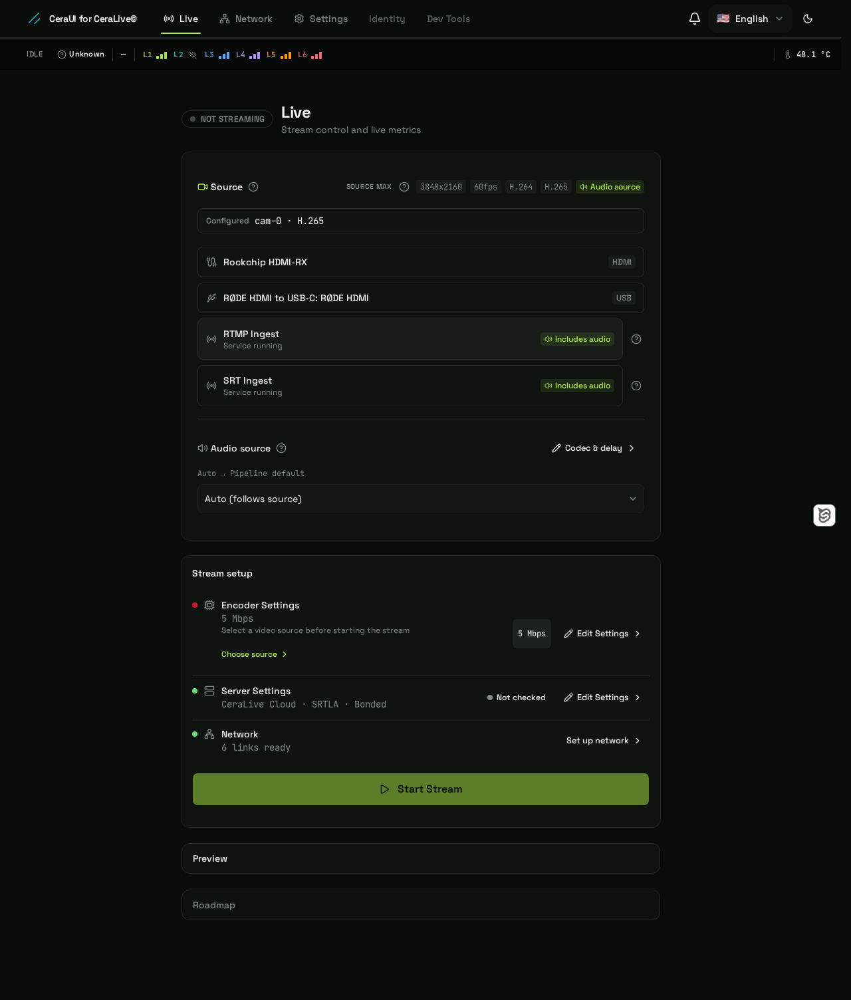 | 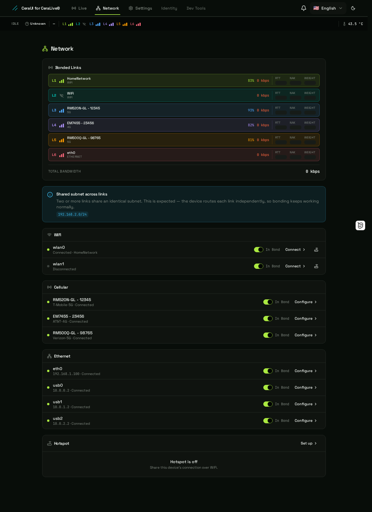 | 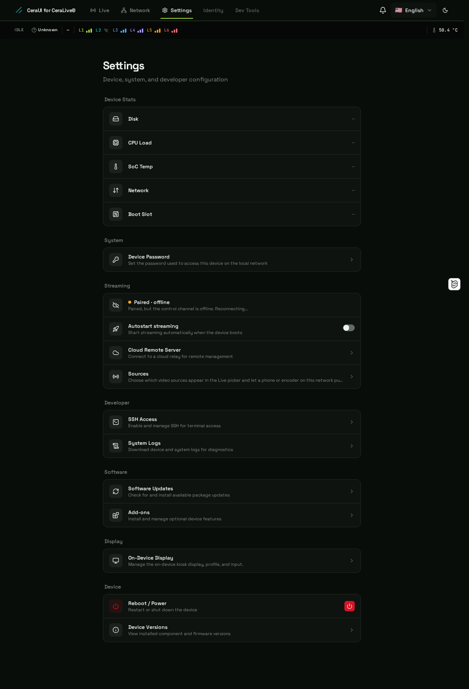 |

### Light Theme

| **Live** | **Network** | **Settings** |
|:--------:|:-----------:|:------------:|
| 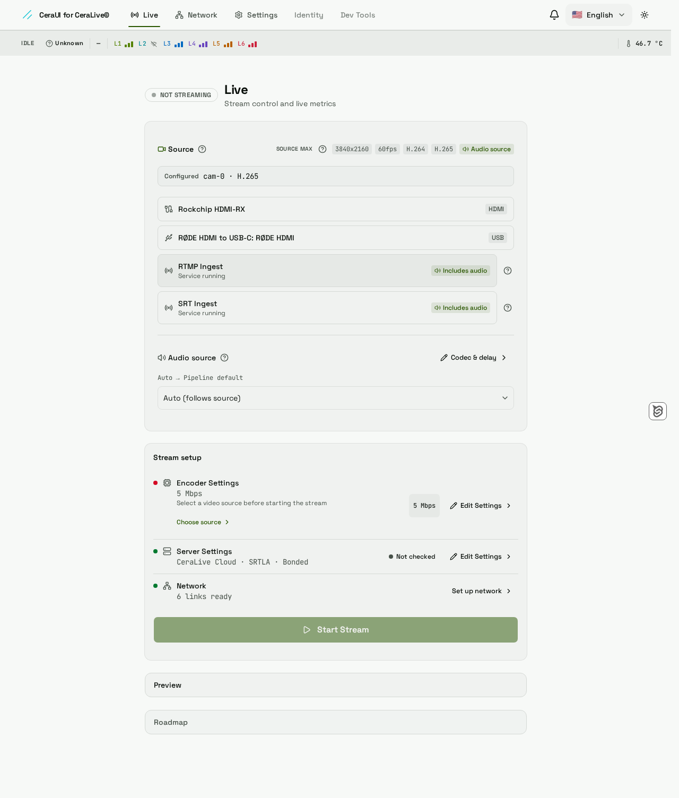 | 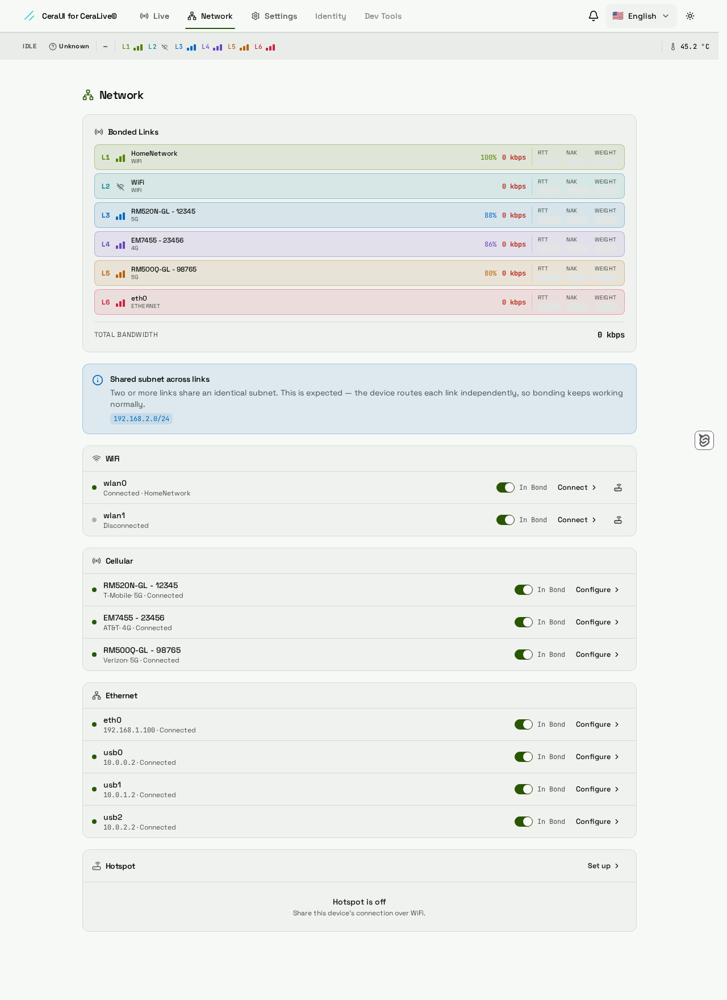 | 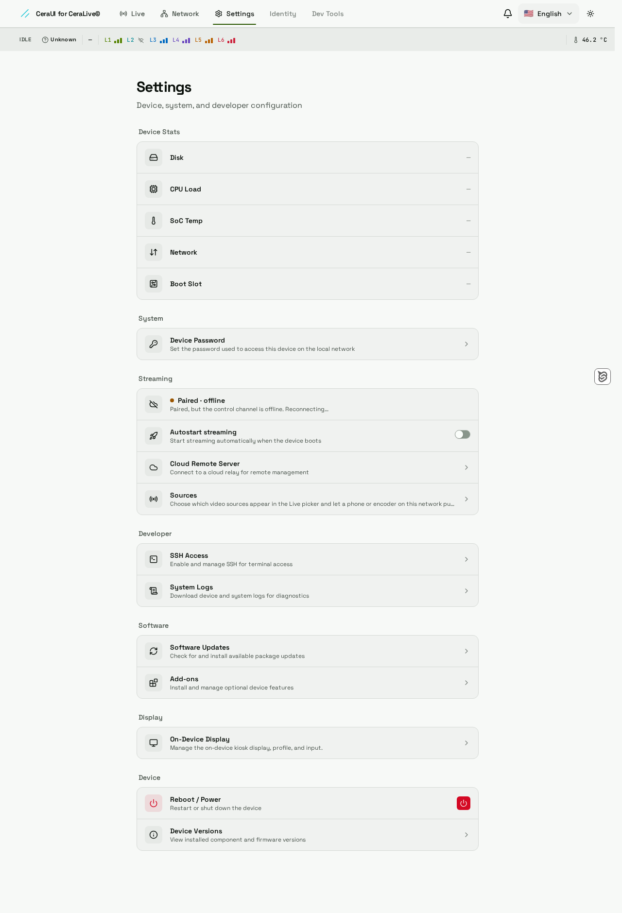 |

---

## 📱 Mobile (390×844)

### Dark Theme

| **Live** | **Network** | **Settings** |
|:--------:|:-----------:|:------------:|
| 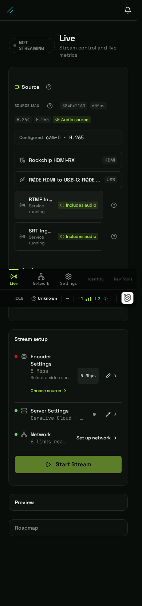 | 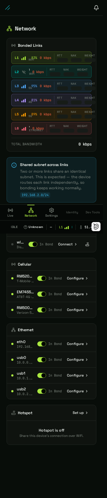 | 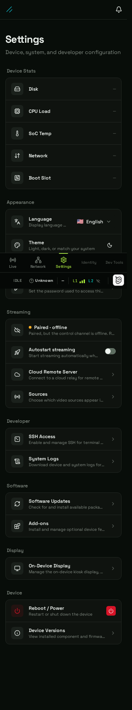 |

### Light Theme

| **Live** | **Network** | **Settings** |
|:--------:|:-----------:|:------------:|
| 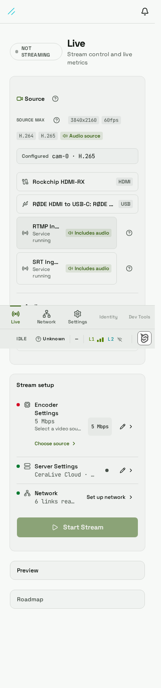 | 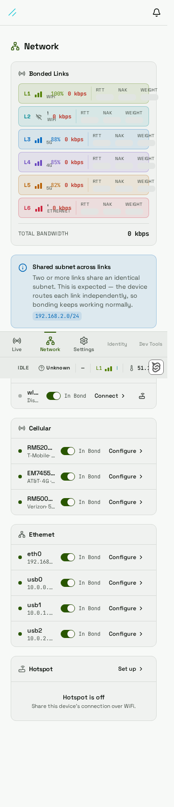 | 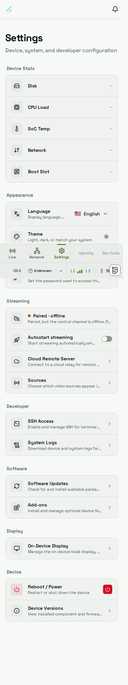 |

---

## 🔴 Live — Streaming Cockpit (Desktop)

The active-streaming state of the **Live** destination: telemetry strip, bitrate
hot-adjust, and per-link ingest stats. Desktop-only (the streaming cockpit is not
captured on mobile).

| **Dark** | **Light** |
|:--------:|:---------:|
| 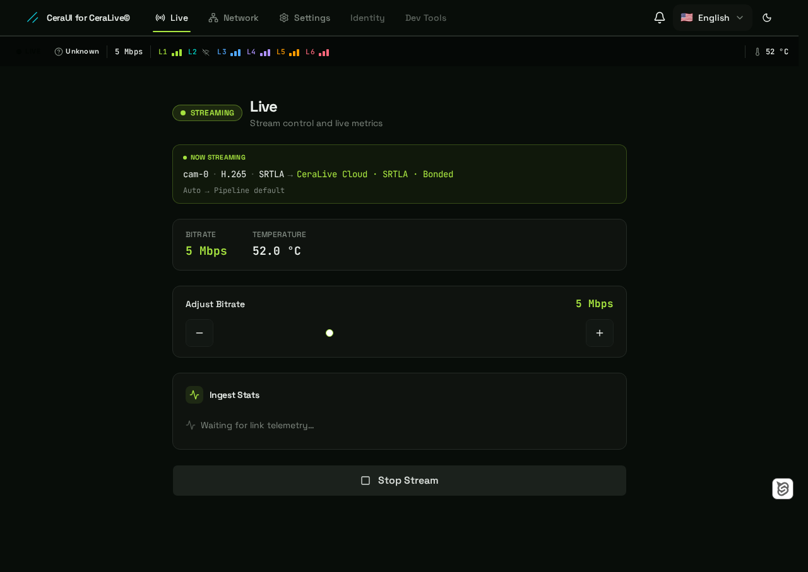 | 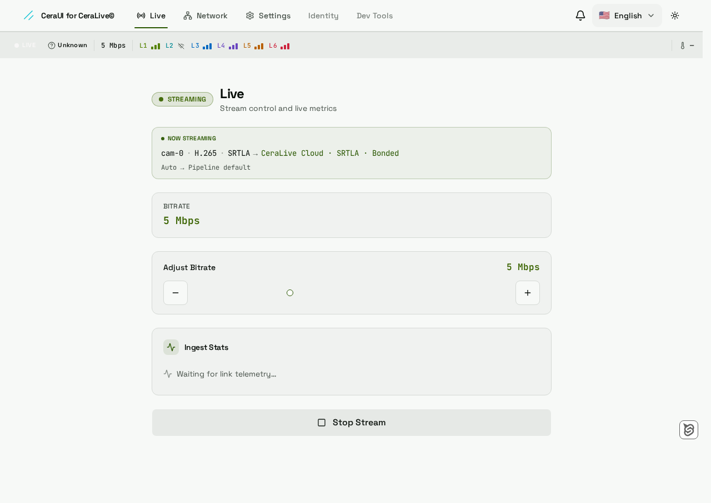 |

---

## 📊 Summary

**14 screenshots total**:

- **12 destination shots** — 2 viewports (desktop, mobile) × 2 themes (dark, light) × 3 destinations (Live, Network, Settings)
- **2 streaming shots** — Live streaming cockpit, desktop only × 2 themes (dark, light)

---

## ⚙️ How Screenshots Are Generated

Screenshots are captured by the Playwright gallery spec
(`tests/e2e/gallery/gallery.visual.spec.ts`), which boots its own dev web server via
`playwright.config` and drives the app with the `multi-modem-wifi` mock scenario. Run
the full gallery from the workspace root:

```bash
bun run screenshots
```

This runs both the `desktop` and `mobile` Playwright projects with `--grep @gallery`.
The streaming test is desktop-only (it `test.skip`s on the mobile project), so the run
emits exactly 14 PNGs, not 16.

**Folder Structure**

```
screenshots/
├── desktop/
│   ├── dark/
│   │   ├── live.png
│   │   ├── network.png
│   │   ├── settings.png
│   │   └── live-streaming.png
│   └── light/
│       ├── live.png
│       ├── network.png
│       ├── settings.png
│       └── live-streaming.png
└── mobile/
    ├── dark/
    │   ├── live.png
    │   ├── network.png
    │   └── settings.png
    └── light/
        ├── live.png
        ├── network.png
        └── settings.png
```
