# 📸 CeraUI Screenshots

Visual documentation of the CeraUI interface across its three primary destinations —
**Live**, **Network**, and **Settings** — captured on desktop and mobile viewports in
both dark and light themes, plus the active-streaming Live cockpit.

Generated automatically by the Playwright gallery spec
(`tests/e2e/gallery/gallery.visual.spec.ts`, tag `@gallery`):

```bash
bun run screenshots
```

> **Gallery ≠ baseline.** Everything on this page above the
> [Visual-regression baselines](#-visual-regression-baselines) section is the
> `@gallery` documentation set: raw `page.screenshot()` output, committed under
> `screenshots/`, and **not** a regression gate. The `@visual` baselines indexed
> at the bottom are the gate, live in `tests/e2e/visual/*.visual.spec.ts-snapshots/`,
> and are compared with `toHaveScreenshot()`.

---

## 🖥️ Desktop (1280×800)

### Dark Theme

| **Live** | **Network** | **Settings** |
|:--------:|:-----------:|:------------:|
| 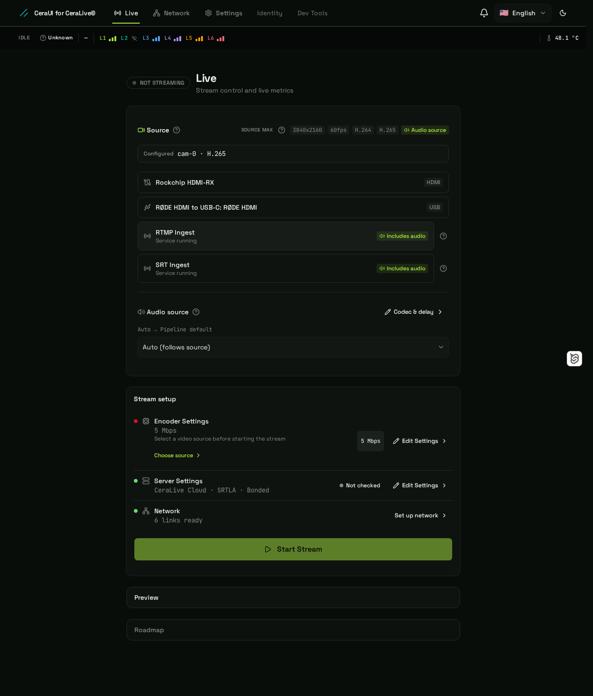 | 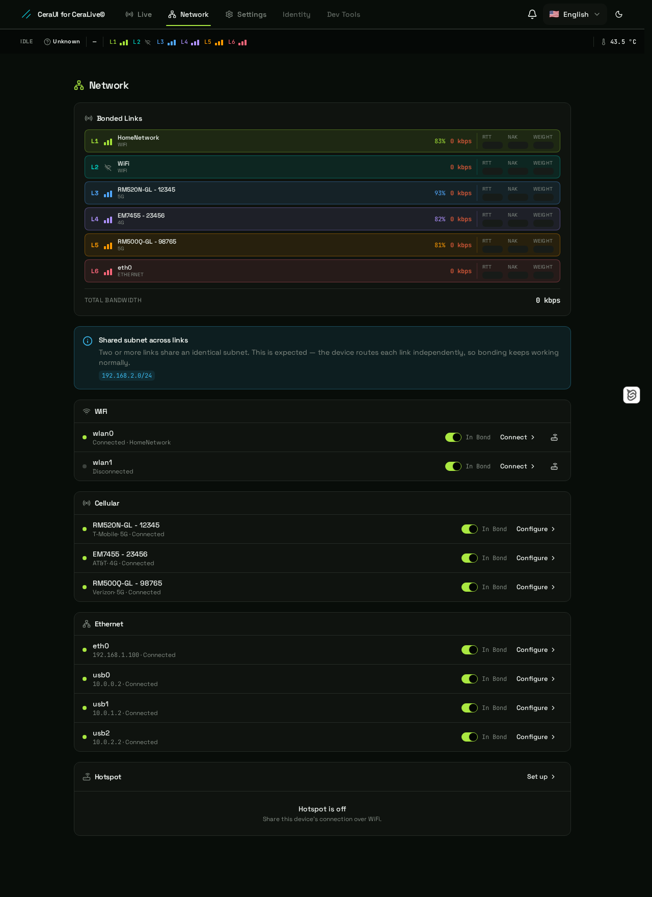 | 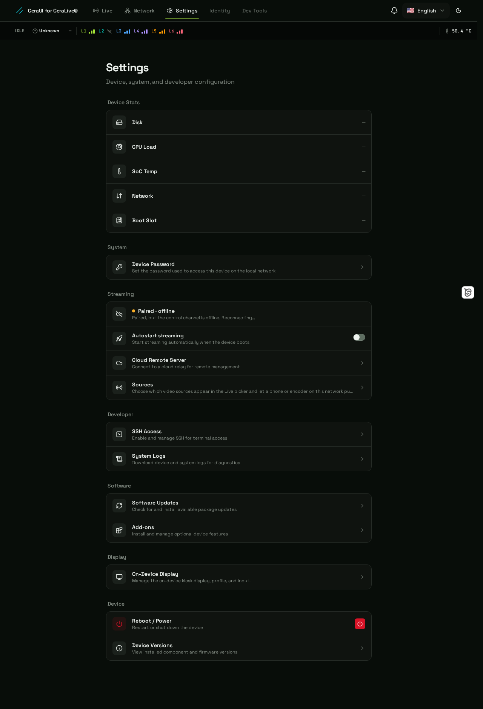 |

### Light Theme

| **Live** | **Network** | **Settings** |
|:--------:|:-----------:|:------------:|
| 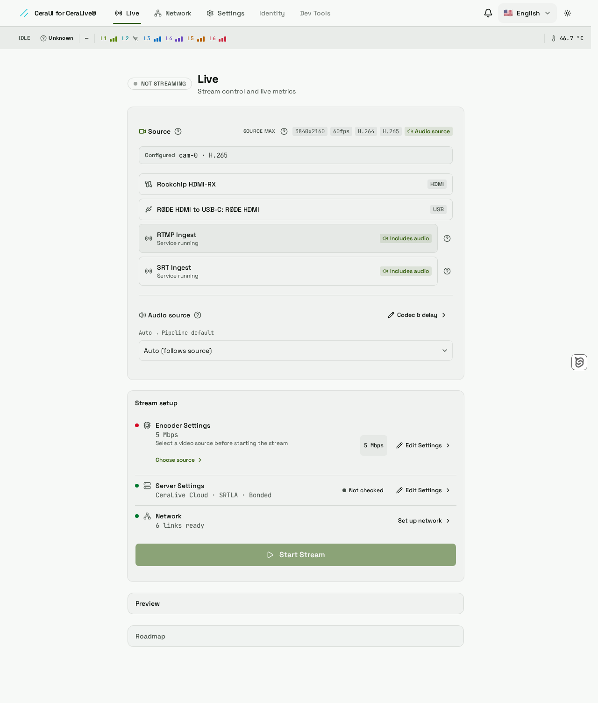 | 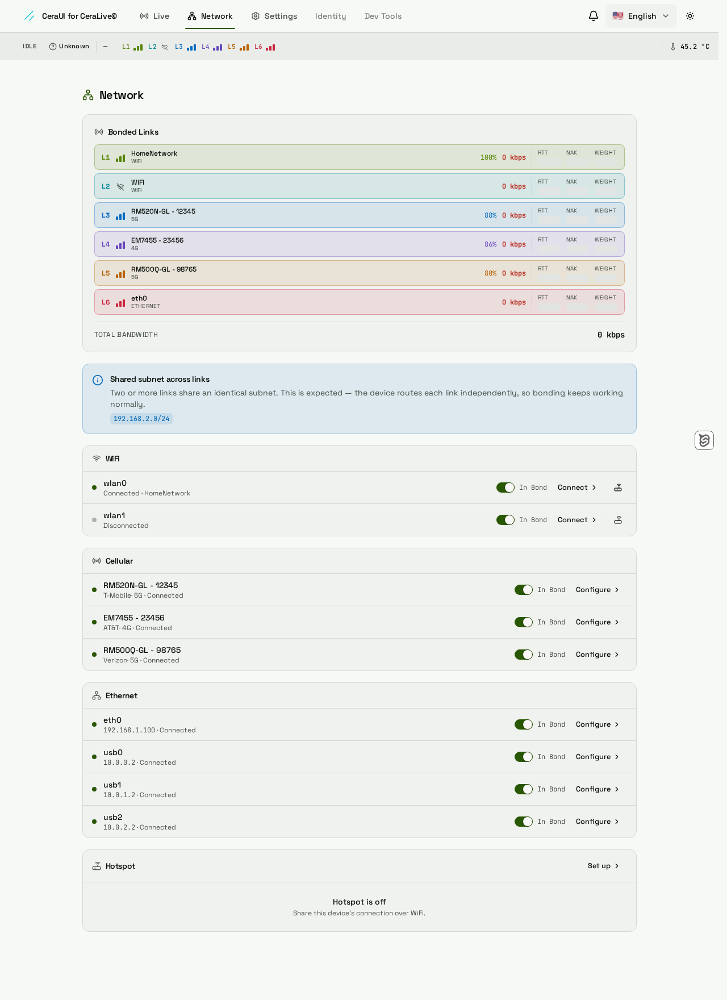 | 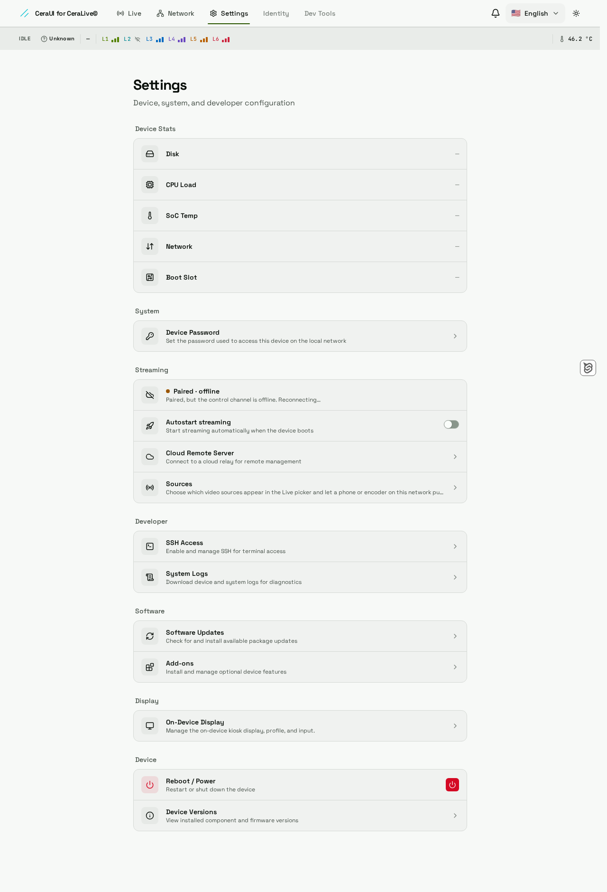 |

---

## 📱 Mobile (390×844)

### Dark Theme

| **Live** | **Network** | **Settings** |
|:--------:|:-----------:|:------------:|
| 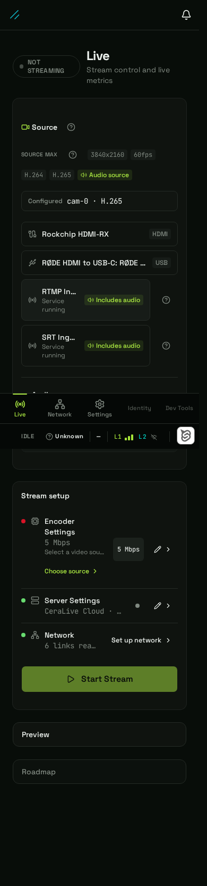 | 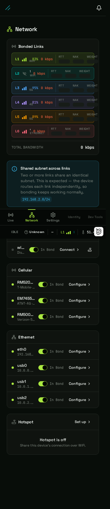 | 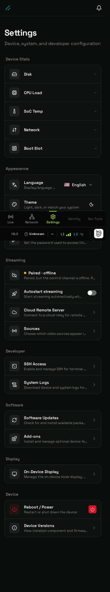 |

### Light Theme

| **Live** | **Network** | **Settings** |
|:--------:|:-----------:|:------------:|
| 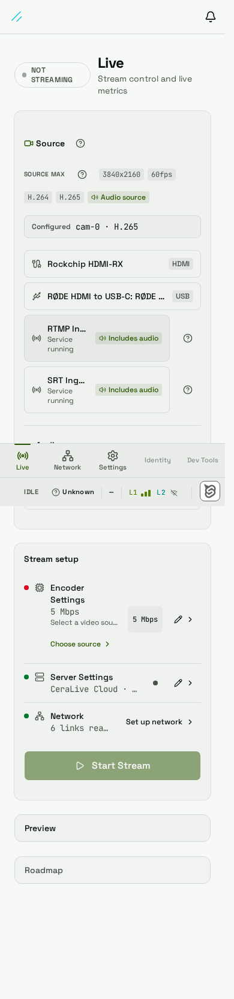 | 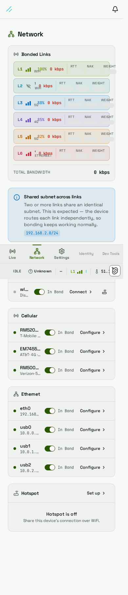 | 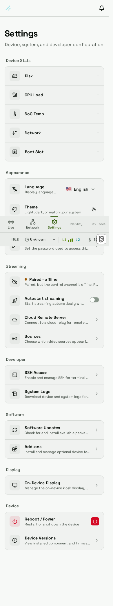 |

---

## 🔴 Live — Streaming Cockpit (Desktop)

The active-streaming state of the **Live** destination: telemetry strip, bitrate
hot-adjust, and per-link ingest stats. Desktop-only (the streaming cockpit is not
captured on mobile).

| **Dark** | **Light** |
|:--------:|:---------:|
| 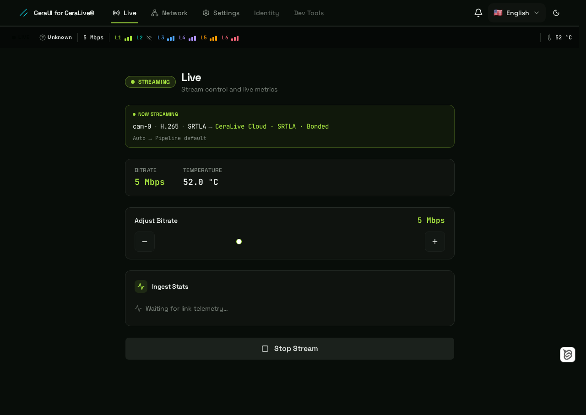 | 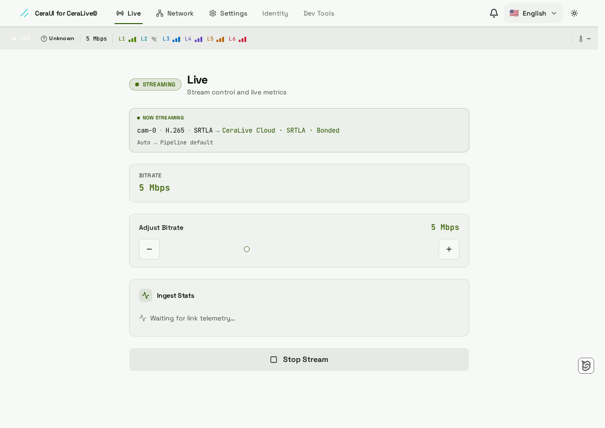 |

---

## 📊 Summary

**14 screenshots total**:

- **12 destination shots** — 2 viewports (desktop, mobile) × 2 themes (dark, light) × 3 destinations (Live, Network, Settings)
- **2 streaming shots** — Live streaming cockpit, desktop only × 2 themes (dark, light)

---

## ⚙️ How Screenshots Are Generated

Screenshots are captured by the Playwright gallery spec
(`tests/e2e/gallery/gallery.visual.spec.ts`), which boots its own dev web server via
`playwright.config` and drives the app with the `multi-modem-wifi` mock scenario. Run
the full gallery from the workspace root:

```bash
bun run screenshots
```

This runs both the `desktop` and `mobile` Playwright projects with `--grep @gallery`.
The streaming test is desktop-only (it `test.skip`s on the mobile project), so the run
emits exactly 14 PNGs, not 16.

**Folder Structure**

```
screenshots/
├── desktop/
│   ├── dark/
│   │   ├── live.png
│   │   ├── network.png
│   │   ├── settings.png
│   │   └── live-streaming.png
│   └── light/
│       ├── live.png
│       ├── network.png
│       ├── settings.png
│       └── live-streaming.png
└── mobile/
    ├── dark/
    │   ├── live.png
    │   ├── network.png
    │   └── settings.png
    └── light/
        ├── live.png
        ├── network.png
        └── settings.png
```

---

## 🧪 Visual-regression baselines

A separate, committed set: the PNGs `toHaveScreenshot()` compares against. They are
NOT documentation — a diff here fails a test. Regenerate deliberately, and only for
the surfaces a change actually touched:

```bash
# every @visual spec
bun run --filter frontend test:e2e:visual -- --update-snapshots

# one surface, both viewport projects
bun run --filter frontend test:e2e -- tests/e2e/visual/<spec>.visual.spec.ts \
  --project=desktop --project=mobile --update-snapshots
```

### Network destination

| Baseline | Spec | Scope |
|---|---|---|
| `network.visual.spec.ts-snapshots/network-desktop-desktop-linux.png` | `network.visual.spec.ts` | Whole destination, **full page** (1280×2761): Bonded Links → Internet Sharing → WiFi → Cellular → Ethernet → Hotspot → Bluetooth |
| `sharing.visual.spec.ts-snapshots/sharing-healthy-desktop-linux.png` | `sharing.visual.spec.ts` | Internet-Sharing card, three healthy uplinks |
| `sharing.visual.spec.ts-snapshots/sharing-degraded-desktop-linux.png` | `sharing.visual.spec.ts` | Internet-Sharing card, every uplink down |
| `sharing.visual.spec.ts-snapshots/sharing-steering-unavailable-desktop-linux.png` | `sharing.visual.spec.ts` | Internet-Sharing card, steering layer refused |

**The network destination baseline is full-page on purpose.** It used to be a bare
viewport capture, which on this destination reaches only Bonded Links and the top of
Internet Sharing — so the WiFi, Cellular and Ethernet cards it is nominally the gate
for were never in it, and restructuring them left the committed PNG byte-identical.

### Mobile variants are regenerated but NOT committed

`.gitignore` excludes `*-mobile-linux.png` ("Playwright visual baseline snapshots —
mobile viewport variants (not part of tracked baselines)"). Running the `mobile`
project writes them to disk beside their desktop siblings, where they are useful
locally, but they are deliberately untracked. The one exception is
`signal-indicator.visual.spec.ts-snapshots/`, whose mobile PNGs were committed before
that rule existed and so remain tracked.

### Surfaces whose `@visual` spec writes evidence, not baselines

`network-density`, `wifi-capability` and `wifi-mode-legibility` assert every criterion
and write their PNGs to the gitignored repo-local `test-results/`. The screenshots are
evidence for a reviewer; the assertions are the gate. Do not convert them to
`toHaveScreenshot()` baselines — a pixel diff cannot tell "clipped" from "restyled".
