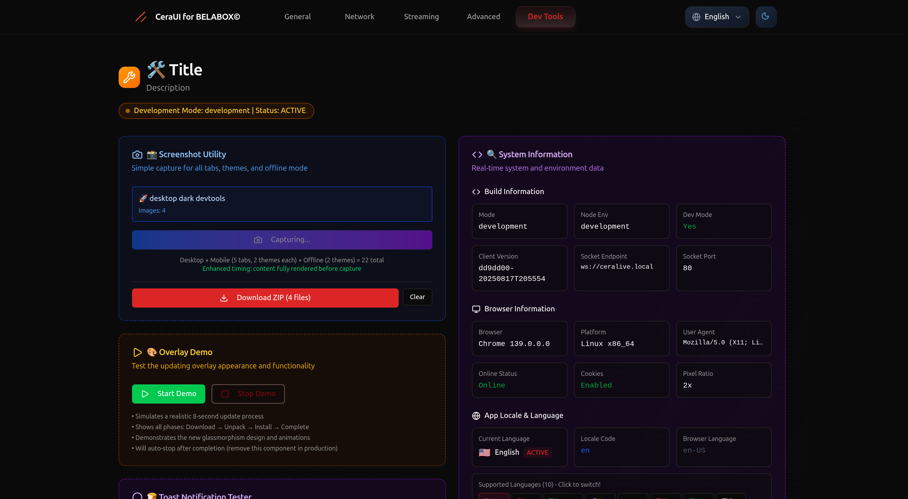
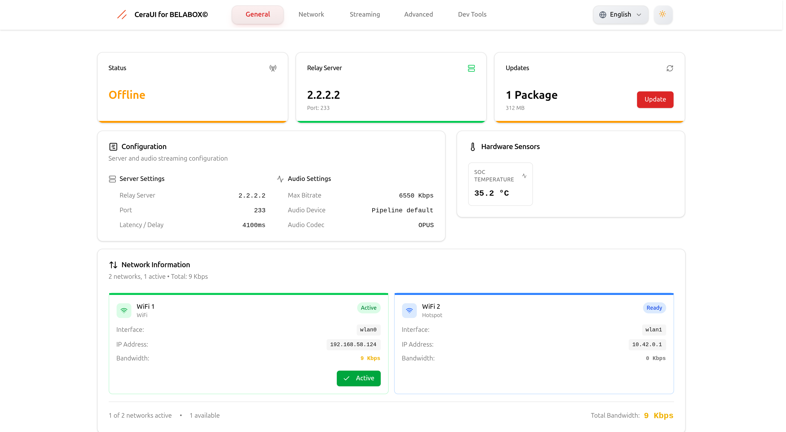
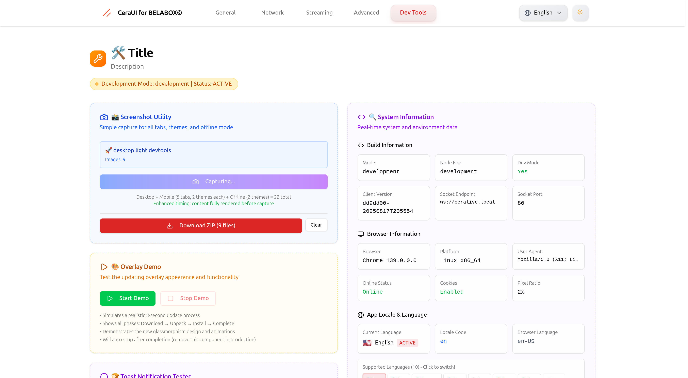
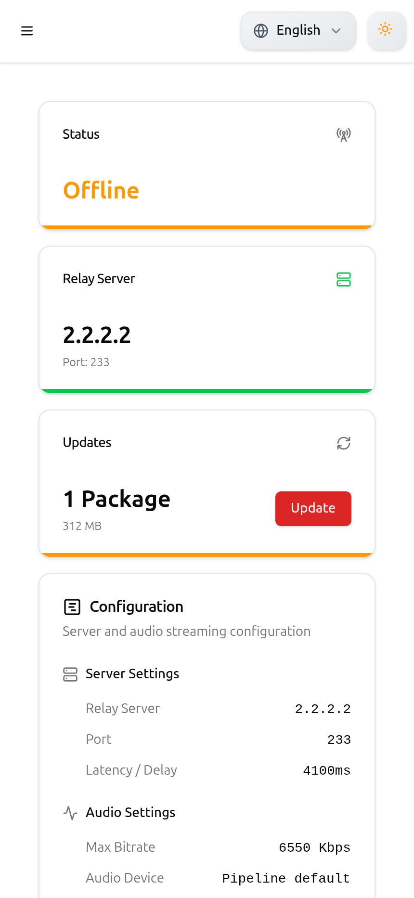
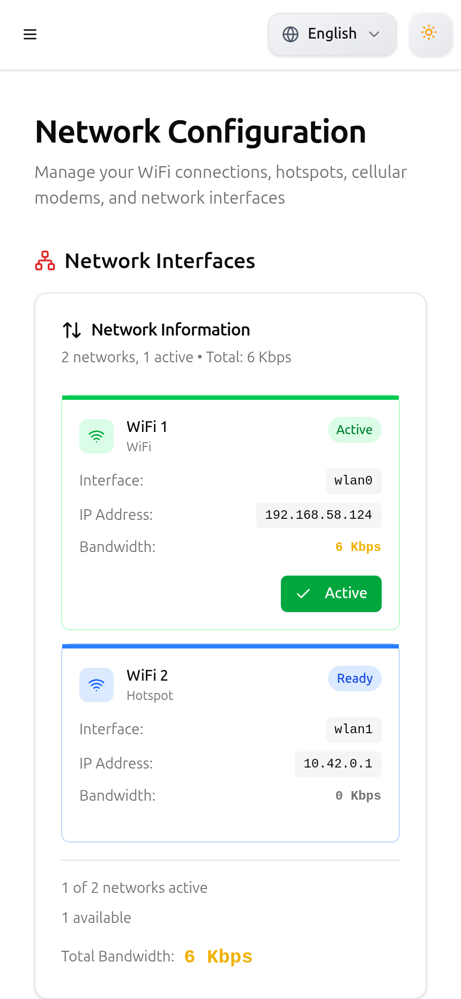
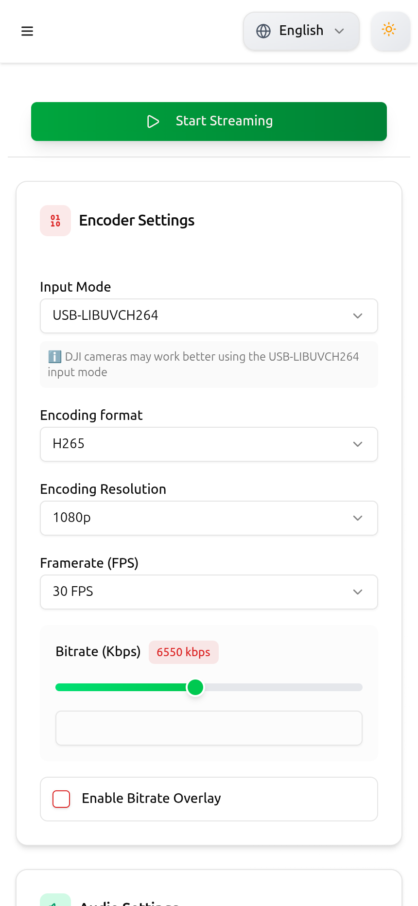
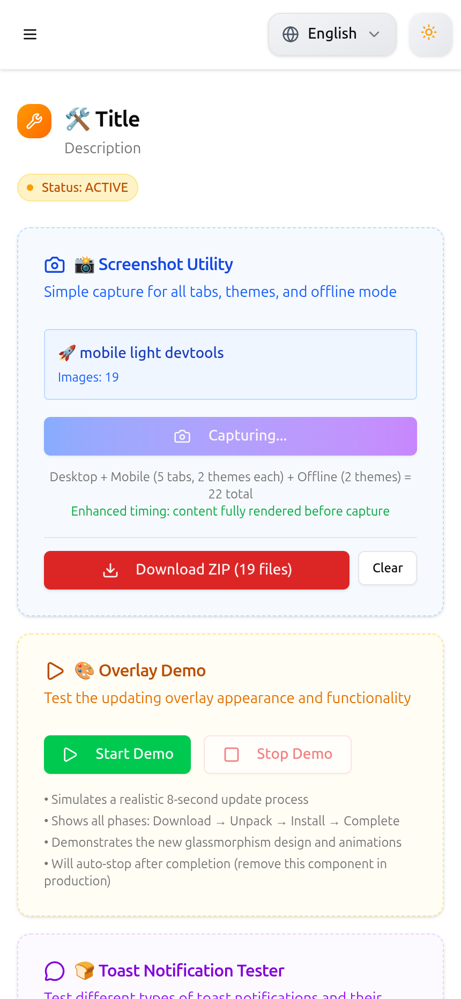
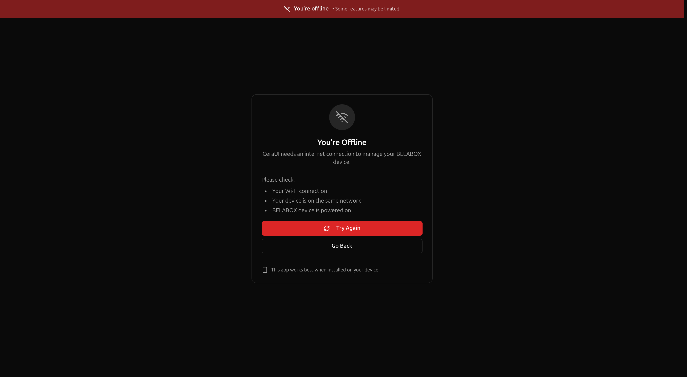
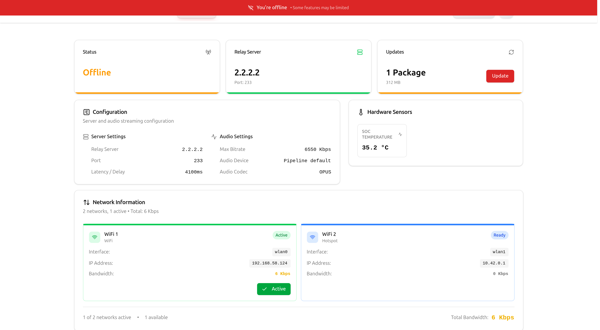

# 📸 CeraUI Screenshots

Visual documentation of the CeraUI interface across desktop and mobile viewports with dark/light theme support.

---

## 🖥️ Desktop (1920×1080)

### Dark Theme

| **General** | **Network** |
|:-----------:|:-----------:|
|  |  |

| **Streaming** | **Advanced** |
|:-------------:|:------------:|
|  |  |

| **DevTools** |
|:------------:|
|  |

### Light Theme

| **General** | **Network** |
|:-----------:|:-----------:|
|  |  |

| **Streaming** | **Advanced** |
|:-------------:|:------------:|
|  |  |

| **DevTools** |
|:------------:|
|  |

---

## 📱 Mobile (430×932)

### Dark Theme

| **General** | **Network** | **Streaming** | **Advanced** | **DevTools** |
|:-----------:|:-----------:|:-------------:|:------------:|:------------:|
|  |  |  |  |  |

### Light Theme

| **General** | **Network** | **Streaming** | **Advanced** | **DevTools** |
|:-----------:|:-----------:|:-------------:|:------------:|:------------:|
|  |  |  |  |  |

---

## 🌐 Offline Mode (PWA)

| **Dark** | **Light** |
|:--------:|:---------:|
|  |  |

---

## 📊 Summary

**22 screenshots total**: 10 desktop + 10 mobile + 2 offline states

---

## ⚙️ How Screenshots Are Generated

Screenshots are captured automatically using the built-in DevTools screenshot utility with html-to-image.

**Folder Structure**
```
screenshots/
├── desktop/
│   ├── dark/
│   └── light/
├── mobile/
│   ├── dark/
│   └── light/
└── features/
    ├── offline-dark.png
    └── offline-light.png
```

> ⚠️ **Note**: Some UI elements (particularly header components like the language selector and theme toggle) may appear slightly different compared to the live application. This is due to the html-to-image library rendering content in isolated iframes, which can affect certain CSS positioning and responsive behaviors.
