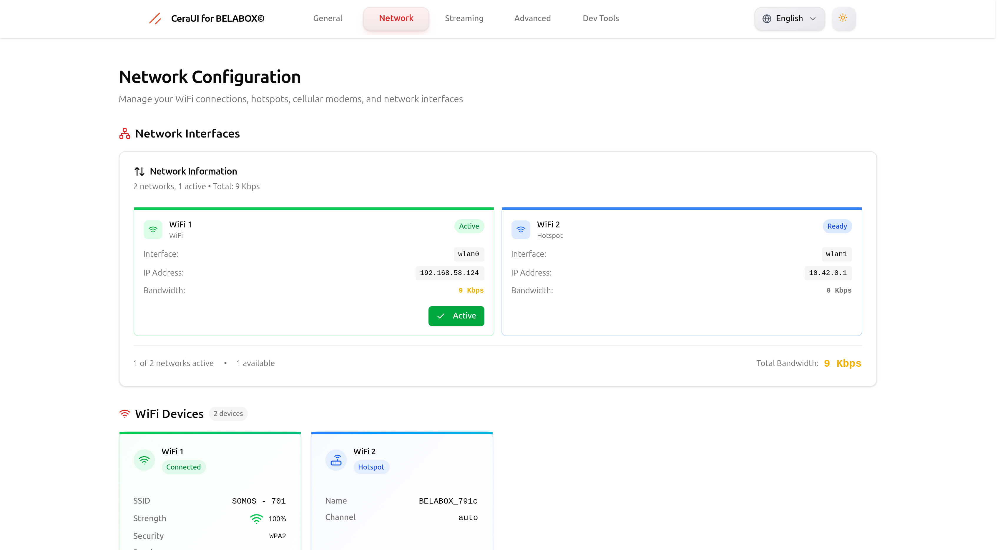
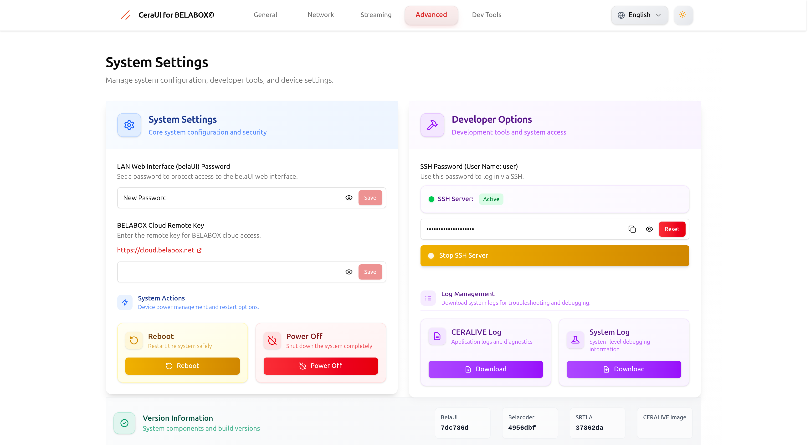
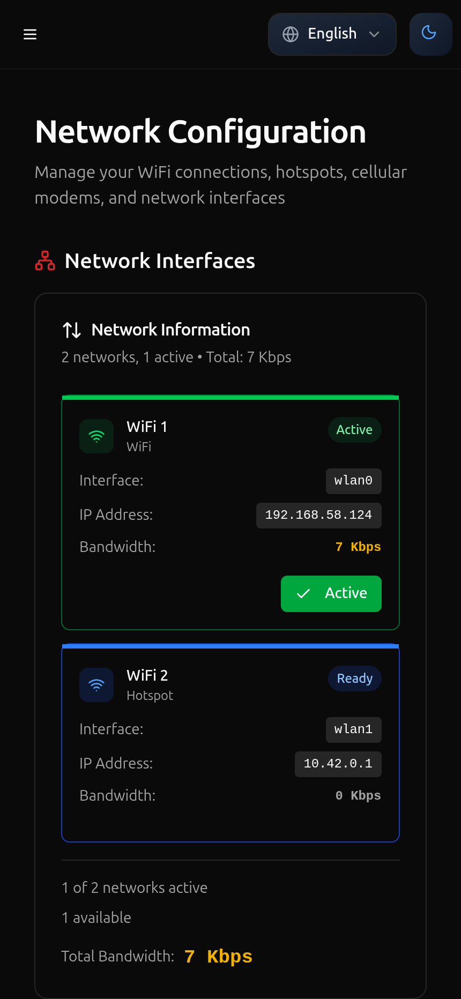
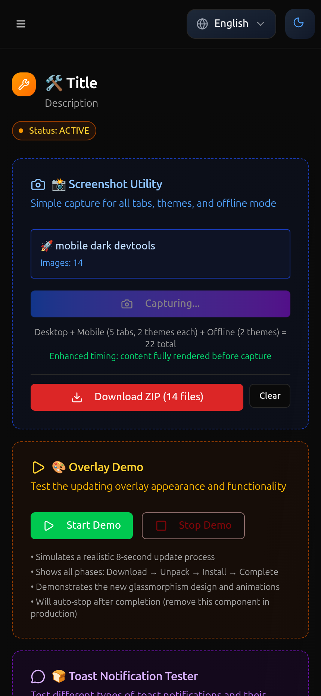
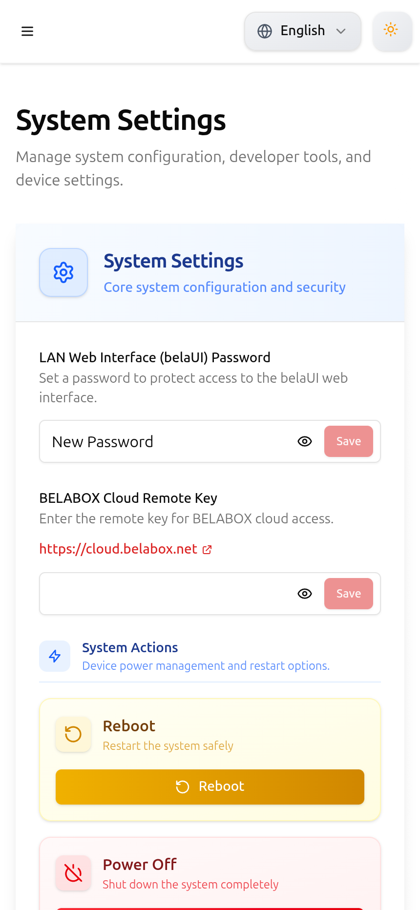

# 📸 CeraUI Visual Gallery

Welcome to the complete visual documentation of CeraUI - a modern, responsive interface built with Svelte 5 and Vite. This gallery showcases the application's core functionality across both desktop and mobile platforms, featuring full dark/light theme support.

## 🎯 Overview

CeraUI provides a complete management interface for CeraLive systems with:
- **Dual Theme Support**: Seamless dark/light theme switching
- **Responsive Design**: Optimized for desktop (1920×1080) and mobile (430×932) viewports
- **Feature-Rich Interface**: Network management, streaming controls, system settings, and developer tools
- **Progressive Web App**: Native app-like experience with offline capabilities

---

## 🖥️ Desktop Interface (1920×1080)

### Dark Theme - Desktop
*Professional dark interface optimized for extended use and low-light environments*

| **General Dashboard** | **Network Management** |
|:---------------------:|:----------------------:|
|  |  |
| System status, relay configuration, updates overview | WiFi interfaces, network monitoring, bandwidth tracking |

| **Streaming Controls** | **Advanced Settings** |
|:----------------------:|:---------------------:|
|  |  |
| Encoder settings, audio config, server management | Security, cloud integration, system actions |

| **Developer Tools** |
|:------------------:|
|  |
| Development utilities, testing tools, system information |

### Light Theme - Desktop
*Clean, bright interface perfect for daylight use and accessibility*

| **General Dashboard** | **Network Management** |
|:---------------------:|:----------------------:|
|  |  |
| System status, relay configuration, updates overview | WiFi interfaces, network monitoring, bandwidth tracking |

| **Streaming Controls** | **Advanced Settings** |
|:----------------------:|:---------------------:|
|  |  |
| Encoder settings, audio config, server management | Security, cloud integration, system actions |

| **Developer Tools** |
|:------------------:|
|  |
| Development utilities, testing tools, system information |

---

## 📱 Mobile Interface (430×932)

### Dark Theme - Mobile
*Touch-optimized dark interface for mobile management*

| **General** | **Network** | **Streaming** | **Advanced** | **DevTools** |
|:-----------:|:-----------:|:-------------:|:------------:|:------------:|
|  |  |  |  |  |
| Mobile dashboard | Network controls | Stream settings | System config | Dev utilities |

### Light Theme - Mobile
*Bright, accessible mobile interface*

| **General** | **Network** | **Streaming** | **Advanced** | **DevTools** |
|:-----------:|:-----------:|:-------------:|:------------:|:------------:|
|  |  |  |  |  |
| Mobile dashboard | Network controls | Stream settings | System config | Dev utilities |

---

## 🌐 Progressive Web App Features
*PWA functionality demonstrations*

| **Offline Mode - Dark** | **Offline Mode - Light** |
|:------------------------:|:-------------------------:|
|  |  |
| Graceful offline state handling with dark theme | Clean offline state with light theme |

---

## 🎨 Design Philosophy

### **Color Themes**
- **Dark Theme**: Professional charcoal backgrounds (#0f0f0f) with vibrant accents
- **Light Theme**: Clean whites and subtle grays for optimal readability
- **Accent Colors**: Consistent blue (#3b82f6) for primary actions and states

### **Typography & Layout**
- **Inter Font Family**: Modern, readable typography across all interfaces
- **Card-Based Design**: Organized content blocks for easy scanning
- **Consistent Spacing**: 4px grid system for uniform layouts
- **Responsive Breakpoints**: Seamless mobile-first responsive design

### **User Experience**
- **Progressive Disclosure**: Information hierarchy from overview to details
- **Real-time Feedback**: Live status indicators and dynamic updates
- **Accessible Controls**: Touch-friendly buttons and clear visual feedback
- **Consistent Navigation**: Unified tab system across all sections

---

## 🔧 Technical Implementation

### **Desktop Features**
- **Full HD Optimization**: Native 1920×1080 viewport rendering
- **Multi-panel Layout**: Efficient screen real estate utilization
- **Keyboard Navigation**: Full keyboard accessibility support
- **Mouse Interactions**: Hover states and precise cursor controls

### **Mobile Features**
- **iPhone 14 Pro Max Optimization**: Native 430×932 viewport
- **Touch Gestures**: Swipe navigation and touch-optimized controls
- **Responsive Images**: Optimized loading for mobile bandwidth
- **PWA Integration**: Add to home screen and offline functionality

### **Cross-Platform Consistency**
- **Unified Component Library**: Shared components between desktop/mobile
- **State Management**: Consistent data flow across platforms
- **Theme Persistence**: Automatic theme preference saving
- **Performance Optimization**: Fast loading and smooth animations

---

## 📊 Interface Sections Detailed

### **1. General Dashboard**
- **System Status**: Online/offline indicators with real-time updates
- **Relay Configuration**: Server IP (2.2.2.2) and port (233) management
- **Hardware Monitoring**: SoC temperature (36.1°C) and system health
- **Update Management**: Package notifications and version control
- **Quick Actions**: Essential system controls at a glance

### **2. Network Management**
- **WiFi Interfaces**: Individual adapter control (wlan0, wlan1)
- **Connection Details**: IP addresses, signal strength, bandwidth
- **Hotspot Management**: CeraLive hotspot configuration
- **Security Information**: WPA2 settings and encryption details
- **Network Monitoring**: Real-time bandwidth and connection status

### **3. Streaming Controls**
- **Video Encoder**: H265 codec, 1080p@30fps, 6550 Kbps bitrate
- **Audio Configuration**: Opus codec with delay synchronization
- **Input Sources**: USB-LIBUVCH264 for DJI camera compatibility
- **Server Settings**: SRTLA receiver and manual configuration
- **Quality Controls**: Real-time bitrate overlay and adjustments

### **4. Advanced System Settings**
- **Security**: Web interface password protection
- **Cloud Integration**: CeraLive Cloud remote key management
- **System Actions**: Safe reboot and shutdown procedures
- **Developer Access**: SSH server with secure password controls
- **Maintenance**: Log downloads and system diagnostics

### **5. Developer Tools** *(Development Only)*
- **Screenshot Utility**: Automated capture for all tabs, themes, and offline mode
- **Component Testing**: UI element validation and testing tools
- **System Information**: Real-time browser metrics and performance data
- **Internationalization**: Multi-language support (10+ languages)
- **Debug Console**: Console testing with different log levels
- **Performance Monitoring**: Live memory usage and viewport analysis

---

## 🌐 Internationalization Support

CeraUI supports comprehensive internationalization with complete translations available for:

- **English** (en) - Primary language
- **Spanish** (es) - Español
- **French** (fr) - Français
- **German** (de) - Deutsch
- **Italian** (it) - Italiano
- **Portuguese** (pt) - Português
- **Russian** (ru) - Русский
- **Japanese** (ja) - 日本語
- **Chinese** (zh) - 中文
- **Hindi** (hi) - हिन्दी

All interface elements, including notifications and system messages, are fully localized for each supported language.

---

## 📈 Performance Metrics

### **Loading Performance**
- **Initial Load**: < 2s on modern browsers
- **Theme Switching**: < 100ms transition time
- **Image Optimization**: WebP format with fallbacks

### **Responsive Performance**
- **Mobile Viewport**: Optimized for 430×932 (iPhone 14 Pro Max)
- **Desktop Viewport**: Native 1920×1080 rendering
- **Cross-device**: Consistent 60fps animations
- **Touch Response**: < 50ms input latency

---

## 📊 Screenshot Coverage Summary

**Total Screenshots: 22**
- **Desktop Interface**: 10 screenshots (5 tabs × 2 themes)
- **Mobile Interface**: 10 screenshots (5 tabs × 2 themes)  
- **PWA Offline Mode**: 2 screenshots (2 themes)

**Tabs Covered**: General, Network, Streaming, Advanced, DevTools  
**Themes**: Dark and Light modes for all interfaces  
**Platforms**: Desktop (1920×1080) and Mobile (430×932) viewports

---

## 🔧 Screenshot Technology

**Enhanced Timing System**
- Content fully rendered before capture
- Font loading completion detection
- Image loading verification
- Animation stability checks
- Theme transition completion

**Quality Optimization**
- 2x pixel ratio for retina-quality images
- Theme-aware background colors
- Viewport-optimized dimensions
- Cross-origin resource handling

**Folder Structure**
```
ceraui-screenshots-YYYY-MM-DD.zip
├── screenshots/
│   ├── desktop/
│   │   ├── dark/          # Dark theme desktop screenshots
│   │   └── light/         # Light theme desktop screenshots
│   ├── mobile/
│   │   ├── dark/          # Dark theme mobile screenshots
│   │   └── light/         # Light theme mobile screenshots
│   └── features/
│       ├── offline-dark.png   # PWA offline mode (dark)
│       └── offline-light.png  # PWA offline mode (light)
```

---

*Screenshots captured using automated html-to-image tools with enhanced timing detection, ensuring consistent quality and accurate representation of the live application interface.*