# 📸 CeraUI Visual Gallery

Welcome to the complete visual documentation of CeraUI - a modern, responsive interface built with Svelte 5 and Vite. This gallery showcases the application's comprehensive functionality across both desktop and mobile platforms, featuring full dark/light theme support.

## 🎯 Overview

CeraUI provides a complete management interface for BELABOX systems with:
- **Dual Theme Support**: Seamless dark/light theme switching
- **Responsive Design**: Optimized for desktop (1920×1080) and mobile (430×932) viewports
- **Feature-Rich Interface**: Network management, streaming controls, system settings, and developer tools
- **Progressive Web App**: Native app-like experience with offline capabilities
- **Interactive Modals**: Dynamic WiFi networks, hotspot configuration, and system overlays

---

## 🖥️ Desktop Interface (1920×1080)

### Dark Theme - Desktop
*Professional dark interface optimized for extended use and low-light environments*

| **General Dashboard** | **Network Management** |
|:---------------------:|:----------------------:|
| 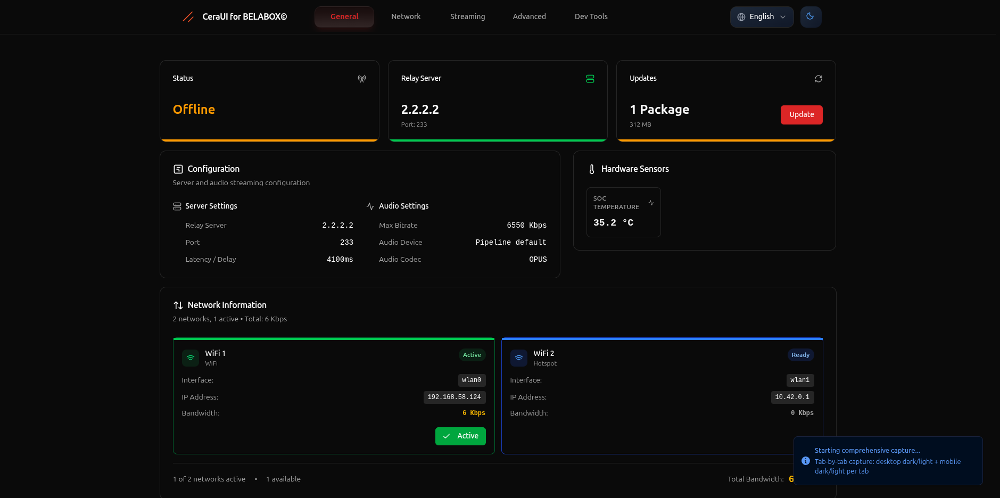 | 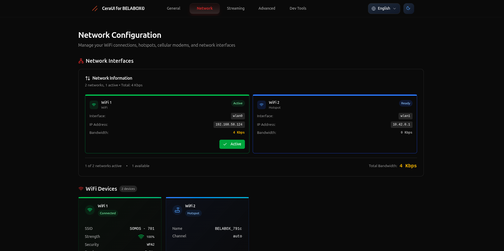 |
| System status, relay configuration, updates overview | WiFi interfaces, network monitoring, bandwidth tracking |

| **Streaming Controls** | **Advanced Settings** |
|:----------------------:|:---------------------:|
| 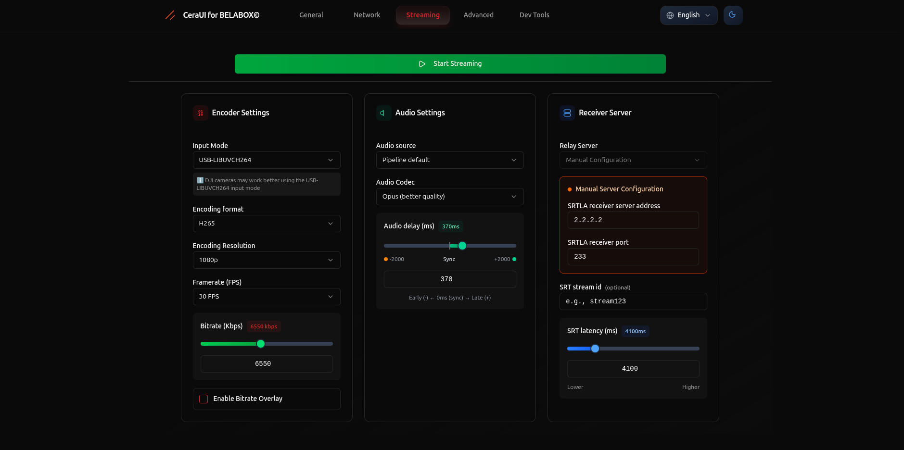 | 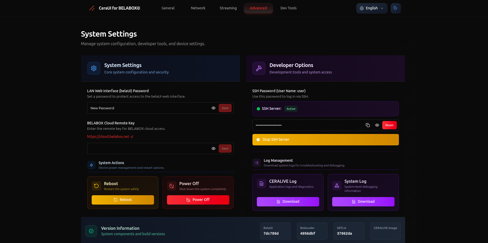 |
| Encoder settings, audio config, server management | Security, cloud integration, system actions |

| **Developer Tools** |
|:------------------:|
| 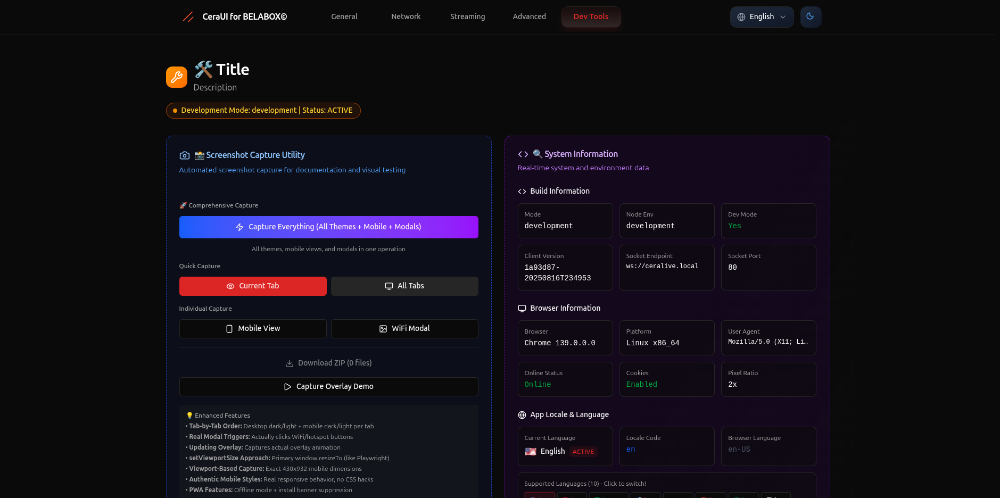 |
| Development utilities, testing tools, system information |

### Light Theme - Desktop
*Clean, bright interface perfect for daylight use and accessibility*

| **General Dashboard** | **Network Management** |
|:---------------------:|:----------------------:|
| 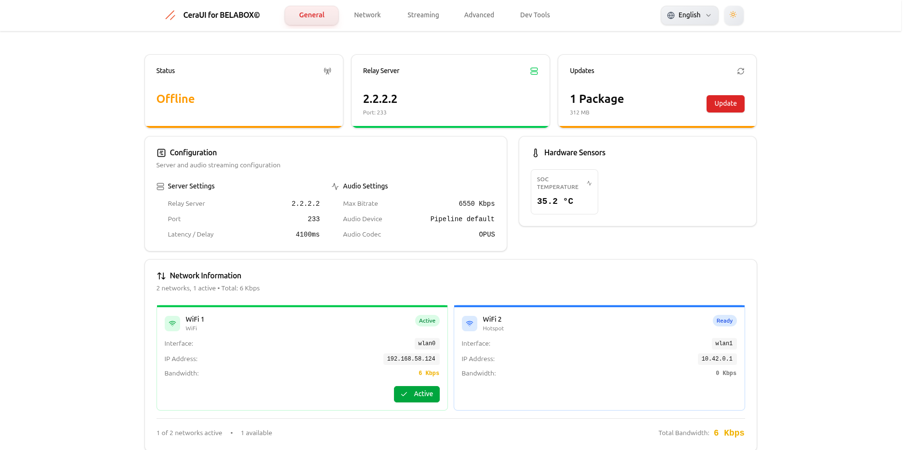 | 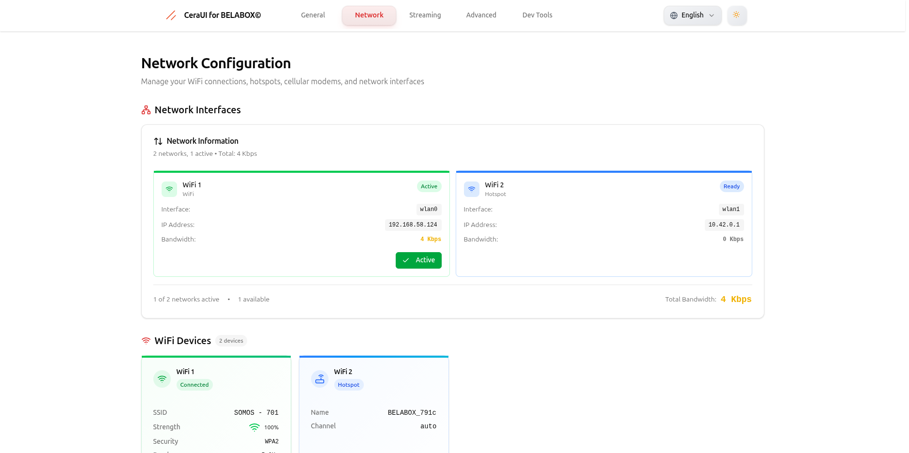 |
| System status, relay configuration, updates overview | WiFi interfaces, network monitoring, bandwidth tracking |

| **Streaming Controls** | **Advanced Settings** |
|:----------------------:|:---------------------:|
| 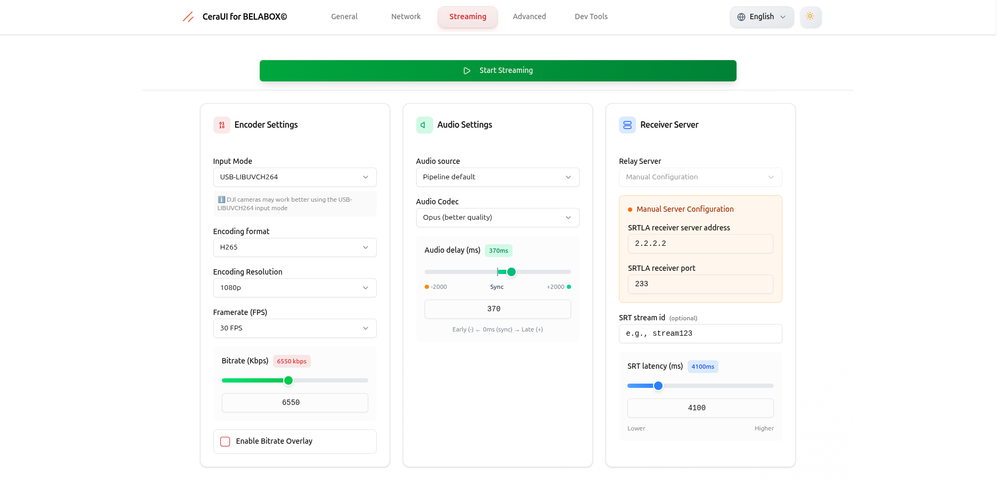 | 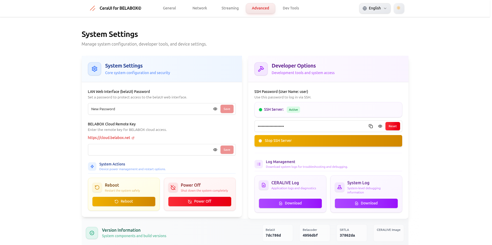 |
| Encoder settings, audio config, server management | Security, cloud integration, system actions |

| **Developer Tools** |
|:------------------:|
| 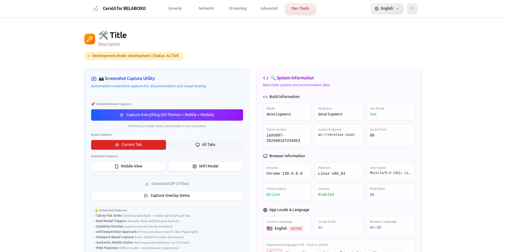 |
| Development utilities, testing tools, system information |

---

## 📱 Mobile Interface (430×932)

### Dark Theme - Mobile
*Touch-optimized dark interface for mobile management*

| **General** | **Network** | **Streaming** | **Advanced** |
|:-----------:|:-----------:|:-------------:|:------------:|
| 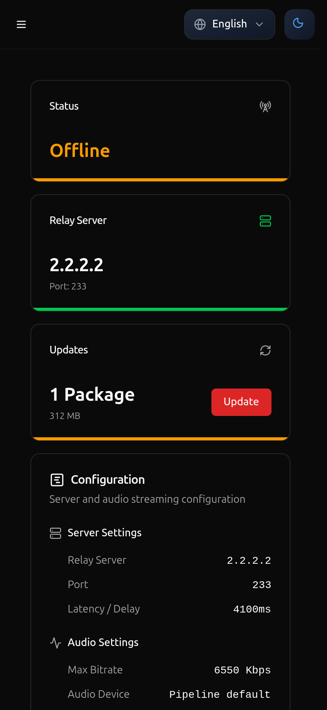 | 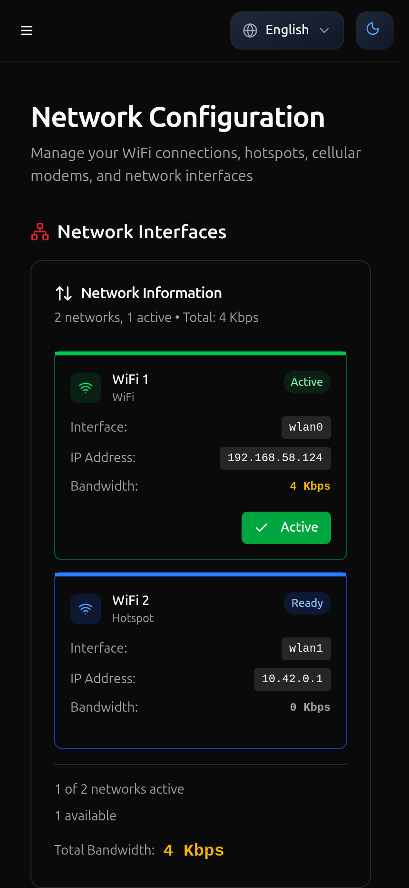 | 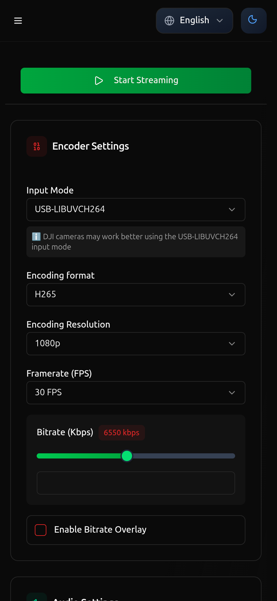 | 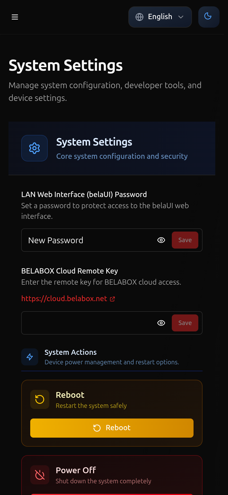 |
| Mobile dashboard | Network controls | Stream settings | System config |

### Light Theme - Mobile
*Bright, accessible mobile interface*

| **General** | **Network** | **Streaming** | **Advanced** |
|:-----------:|:-----------:|:-------------:|:------------:|
| 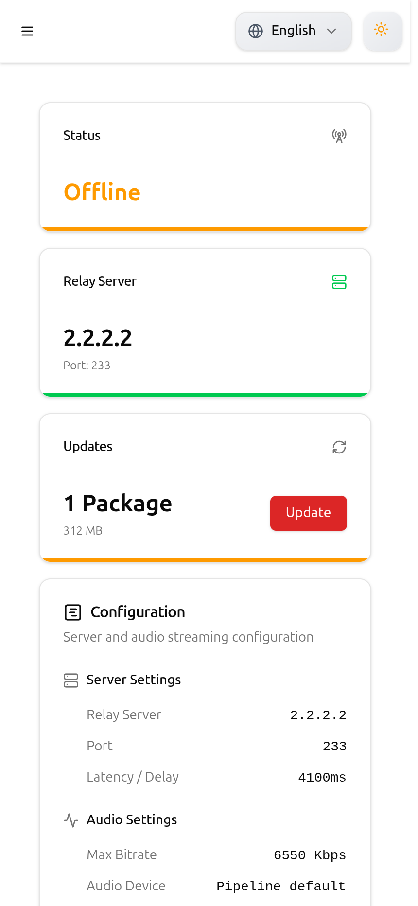 | 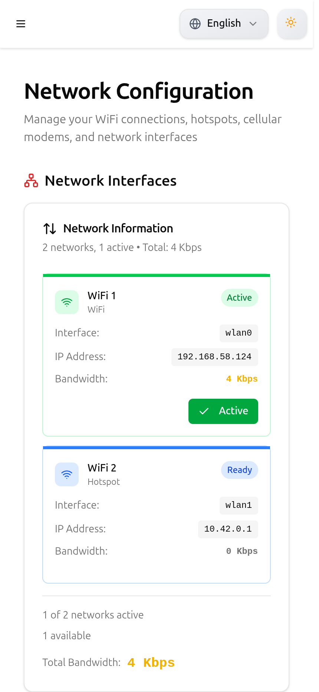 | 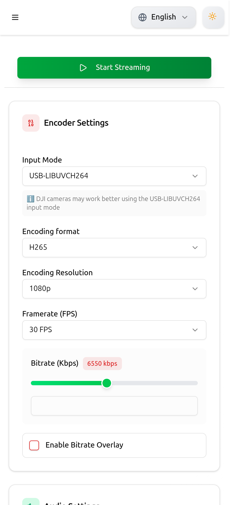 | 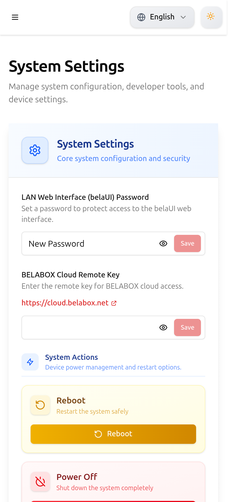 |
| Mobile dashboard | Network controls | Stream settings | System config |

---

## 🎛️ Interactive Features & Modals

### Network Configuration Modals
*Dynamic network management interfaces*

| **WiFi Networks Selector** | **Hotspot Configurator** |
|:---------------------------:|:------------------------:|
|  |  |
| Browse and connect to available WiFi networks | Configure BELABOX hotspot settings |

### System Demonstrations
*Live system state demonstrations*

| **Update Process Overlay** |
|:---------------------------:|
| 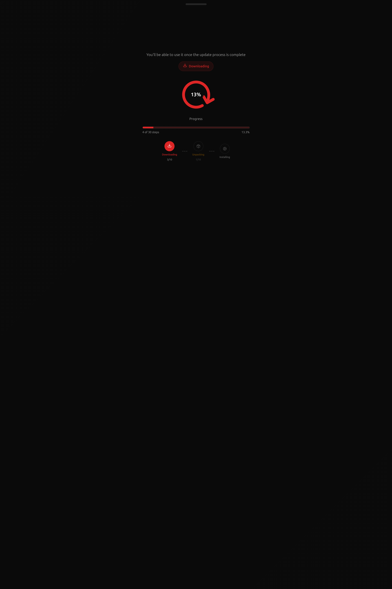 |
| Real-time update progress with system feedback |

### Progressive Web App States
*PWA functionality demonstrations*

| **Offline Mode** |
|:----------------:|
| 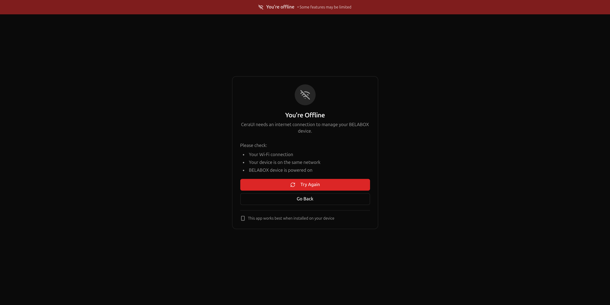 |
| Graceful offline state handling with user feedback |

---

## 🎨 Design Philosophy

### **Color Themes**
- **Dark Theme**: Professional charcoal backgrounds (#0f0f0f) with vibrant accents
- **Light Theme**: Clean whites and subtle grays for optimal readability
- **Accent Colors**: Consistent blue (#3b82f6) for primary actions and states

### **Typography & Layout**
- **Inter Font Family**: Modern, readable typography across all interfaces
- **Card-Based Design**: Organized content blocks for easy scanning
- **Consistent Spacing**: 4px grid system for uniform layouts
- **Responsive Breakpoints**: Seamless mobile-first responsive design

### **User Experience**
- **Progressive Disclosure**: Information hierarchy from overview to details
- **Real-time Feedback**: Live status indicators and dynamic updates
- **Accessible Controls**: Touch-friendly buttons and clear visual feedback
- **Consistent Navigation**: Unified tab system across all sections

---

## 🔧 Technical Implementation

### **Desktop Features**
- **Full HD Optimization**: Native 1920×1080 viewport rendering
- **Multi-panel Layout**: Efficient screen real estate utilization
- **Keyboard Navigation**: Full keyboard accessibility support
- **Mouse Interactions**: Hover states and precise cursor controls

### **Mobile Features**
- **iPhone 14 Pro Max Optimization**: Native 430×932 viewport
- **Touch Gestures**: Swipe navigation and touch-optimized controls
- **Responsive Images**: Optimized loading for mobile bandwidth
- **PWA Integration**: Add to home screen and offline functionality

### **Cross-Platform Consistency**
- **Unified Component Library**: Shared components between desktop/mobile
- **State Management**: Consistent data flow across platforms
- **Theme Persistence**: Automatic theme preference saving
- **Performance Optimization**: Fast loading and smooth animations

---

## 📊 Interface Sections Detailed

### **1. General Dashboard**
- **System Status**: Online/offline indicators with real-time updates
- **Relay Configuration**: Server IP (2.2.2.2) and port (233) management
- **Hardware Monitoring**: SoC temperature (36.1°C) and system health
- **Update Management**: Package notifications and version control
- **Quick Actions**: Essential system controls at a glance

### **2. Network Management**
- **WiFi Interfaces**: Individual adapter control (wlan0, wlan1)
- **Connection Details**: IP addresses, signal strength, bandwidth
- **Hotspot Management**: BELABOX hotspot configuration
- **Security Information**: WPA2 settings and encryption details
- **Network Monitoring**: Real-time bandwidth and connection status

### **3. Streaming Controls**
- **Video Encoder**: H265 codec, 1080p@30fps, 6550 Kbps bitrate
- **Audio Configuration**: Opus codec with delay synchronization
- **Input Sources**: USB-LIBUVCH264 for DJI camera compatibility
- **Server Settings**: SRTLA receiver and manual configuration
- **Quality Controls**: Real-time bitrate overlay and adjustments

### **4. Advanced System Settings**
- **Security**: Web interface password protection
- **Cloud Integration**: BELABOX Cloud remote key management
- **System Actions**: Safe reboot and shutdown procedures
- **Developer Access**: SSH server with secure password controls
- **Maintenance**: Log downloads and system diagnostics

### **5. Developer Tools**
- **Component Testing**: UI element validation and testing
- **System Information**: Browser metrics and performance data
- **Internationalization**: Multi-language support (10+ languages)
- **Debug Console**: Real-time logging and error tracking
- **Performance Monitoring**: Memory usage and viewport analysis

---

## 🌐 Internationalization Support

CeraUI supports comprehensive internationalization with complete translations available for:

- **English** (en) - Primary language
- **Spanish** (es) - Español
- **French** (fr) - Français
- **German** (de) - Deutsch
- **Italian** (it) - Italiano
- **Portuguese** (pt) - Português
- **Russian** (ru) - Русский
- **Japanese** (ja) - 日本語
- **Chinese** (zh) - 中文
- **Hindi** (hi) - हिन्दी

All interface elements, including modals, notifications, and system messages, are fully localized for each supported language.

---

## 📈 Performance Metrics

### **Loading Performance**
- **Initial Load**: < 2s on modern browsers
- **Theme Switching**: < 100ms transition time
- **Modal Animations**: 300ms smooth transitions
- **Image Optimization**: WebP format with fallbacks

### **Responsive Performance**
- **Mobile Viewport**: Optimized for 430×932 (iPhone 14 Pro Max)
- **Desktop Viewport**: Native 1920×1080 rendering
- **Cross-device**: Consistent 60fps animations
- **Touch Response**: < 50ms input latency

---

*Screenshots captured using automated testing tools ensuring consistent quality and accurate representation of the live application interface.*